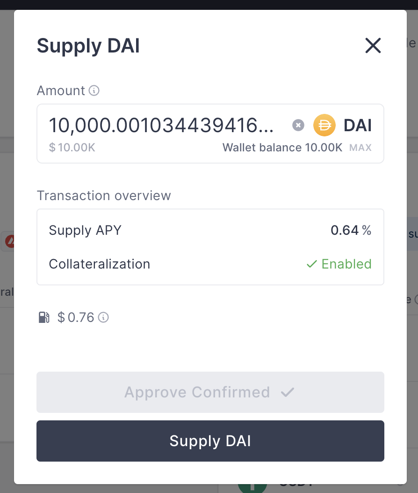

# Fun Wallet SDK Test

This repo provides a React wrapper around the Fun SDK, which can be found at https://www.npmjs.com/package/@fun-wallet/sdk

## Install & Run the Project

1. Clone the repo:
 `git clone https://github.com/TheFunGroup/fun-wallet-test-react.git`
2. Make sure you're in the right directory:
`cd fun-wallet-test-react`
3. Install the required packages (including @fun-wallet/sdk):
`npm install`
4. Start the web app:
`npm start`

## Aave Setup

1. Visit https://app.aave.com/faucet/ and get some Fuji DAI

2. Visit https://app.aave.com/ and supply an asset (e.g Fuji DAI)

## Use the Project

The project can be used in one of 2 ways by clicking the switch button on the web app.

#### With a known private key

1. Enter the known private key into the first text field
2. Enter the address of the Aave a-token used to close an Aave position. This should correspond to an a-token in the EOA specified by the above private key.
3. Click "Run Test" ( only once, takes a second :) )

#### With MetaMask

1. Enter the address of the Aave a-token used to close an Aave position. This should correspond to an a-token in the EOA specified by the MetaMask pop-up.
2. Click "Run Test" ( only once, takes a second :) ). There will be a series of MetaMask popups for the user to sign.